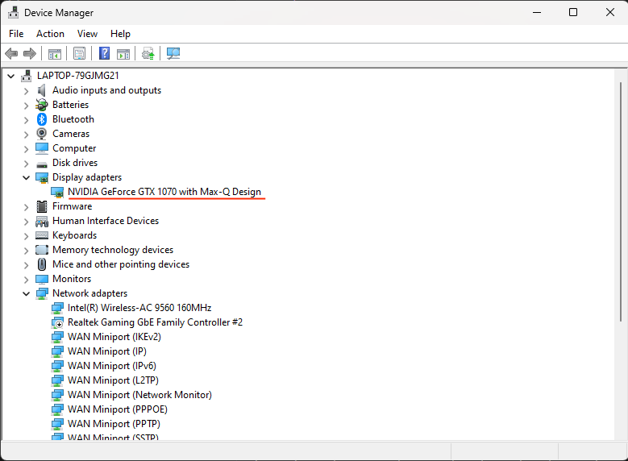
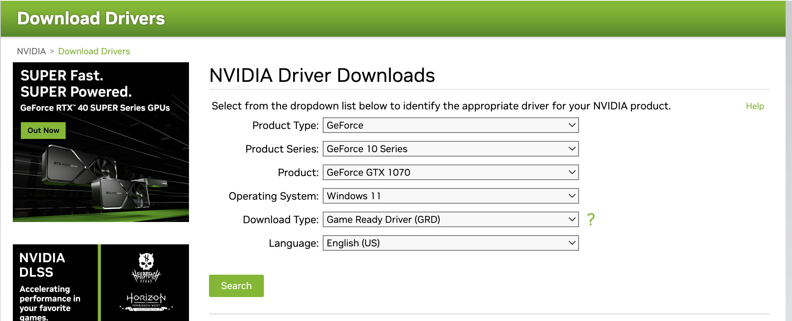
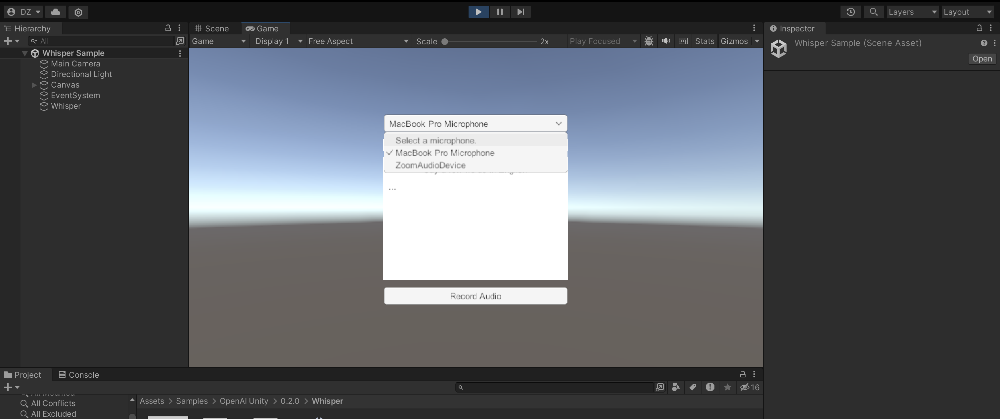

<h1 align="center">
    <br>
    Shape E for Unity
    <br>
</h1>
<table align="center">
    <tbody>
        <tr>
            <td align="center">
                
            </td>
            <td align="center">
                
            </td>
            <td align="center">
                
            </td>
        </tr>
        <tr>
            <td align="center">A birthday cake</td>
            <td align="center">A wine bottle</td>
            <td align="center">A bowl of soup</td>
        </tr>
    </tbody>
</table>

## Overview
This Unity application leverages the capabilities of Shape-E, a cutting-edge technology, to convert speech into detailed 3D models. It provides an intuitive interface for users to simply speak into their microphone and generate 3D representations of their descriptions. 

## Setup
> [!NOTE]  
> You should have Python 3 installed on your computer. It should be Python 3.9 or above.


### For Windows Users:
1. First, make sure your computer is compatible with cuda GPU. You can do this by going to this [link](https://developer.nvidia.com/cuda-gpus)
2. **Install Nvidia driver:** First we need to figure out what driver do we need to get access to GPU card. Search Device Manager and under Display Adapter we are able to see it.

    

    Now, visit https://www.nvidia.com/download/index.aspx and download the specific driver.

    
    
    Upon giving the right information, click on search and we will be redirected to download page. Download and install it. 

3. [Download Anaconda](https://www.anaconda.com/download)

4. **Install Cuda:** To install CUDA, we’ll need to download the CUDA toolkit from [NVIDIA’s official website](https://developer.nvidia.com/cuda-11-8-0-download-archive). Make sure to download the correct version of CUDA toolkit that is compatible with your Windows version and graphics card. This may take a while...

5. **Install cuDNN:** Visit https://developer.nvidia.com/rdp/cudnn-archive and download cuDNN. Make sure to download the most recent installer for Cuda 11.x since we installed Cuda 11.8

    Once we download and Extract the zip file. Ctrl+A to select all and paste it in the directory of Cuda. we are asked to replace it? we clicked on replace button.

6. Download the zip file of this project to your desktop.
    
    Notice that there are three directories within the repository: `shape_e`, `unity_shape_e` and `README_assets`.

    - Go to `shape_e/text_to_3d.py` and change the 

7. Open Anaconda Prompt and run the following commands one-by-one:
    ```sh
    cd Desktop

    python ./research/shape_e/setup.py
    ```
    This will create an anaconda environment for you and install all the required packages to run the program.

8. To use the program you need to create an OpenAI API key.

    <details>
    <summary>Setting Up Your OpenAI Account</summary>
        
    > - Go to https://openai.com/api and sign up for an account
    >
    > - Once you have created an account, go to https://beta.openai.com/account/api-keys
    >
    > - Create a new secret key and save it
    </details>

    <details>
    <summary> Saving Your Credentials</summary>

    > To make requests to the OpenAI API, you need to use your API key. To avoid exposing your API key in your Unity project, you can save it in your device's local storage.
    >
    > To do this, follow these steps:
    >
    > - Create a folder called `.openai` in your home directory (`~/` for Mac) by running the following command in the terminal:
    >
    >   ```sh
    >   mkdir ~/.openai
    >   ``` 
    > - Create a file called auth.json in the .openai folder:
    >
    >   ```sh
    >   touch ~/.openai/auth.json
    >   ```
    >
    > - Add an api_key field and a organization field (if applicable) to the auth.json file and save it. Make sure to replace `<Insert API Key here>` in the command below with your API Key:
    >   
    >   ```sh
    >   echo '{\n\t"api_key": "<Insert API Key here>"\n}' >> ~/.openai/auth.json 
    >   ```
    > - Run the following command: 
    >
    >   ```sh
    >   cat ~/.openai/auth.json
    >   ```
    >   If you did it proparly you should see `{\n\t"api_key": "<Insert API Key here>"\n}` on your screen where `<Insert API Key here>` is replaced by your API Key.
    >
    >
    > Here is an example of what your auth.json file should look like:
    > ```JSON
    >  {
    >       "api_key": "sk-...W6yi"
    >  }

</details>
    
9. Launch the Unity app and add `unity_shape_e` as a new project.

### For Mac Users:
1. [Download Anaconda](https://www.anaconda.com/download)
2. Download the zip file of this project to your desktop.
    
    Notice that there are two directories within the repository: `shape_e` and `unity_shape_e`. 
3. Open terminal and run the following commands one-by-one:
    ```sh
    cd Desktop

    python3 ./research/shape_e/setup.py
    ```
    This will create an anaconda environment for you and install all the required packages to run the program.
4. To use the program you need to create an OpenAI API key.

    <details>
    <summary>Setting Up Your OpenAI Account</summary>
        
    > - Go to https://openai.com/api and sign up for an account
    >
    > - Once you have created an account, go to https://beta.openai.com/account/api-keys
    >
    > - Create a new secret key and save it
    </details>

    <details>
    <summary> Saving Your Credentials</summary>

    > To make requests to the OpenAI API, you need to use your API key. To avoid exposing your API key in your Unity project, you can save it in your device's local storage.
    >
    > To do this, follow these steps:
    >
    > - Create a folder called `.openai` in your home directory (`~/` for Mac) by running the following command in the terminal:
    >
    >   ```sh
    >   mkdir ~/.openai
    >   ``` 
    > - Create a file called auth.json in the .openai folder:
    >
    >   ```sh
    >   touch ~/.openai/auth.json
    >   ```
    >
    > - Add an api_key field and a organization field (if applicable) to the auth.json file and save it. Make sure to replace `<Insert API Key here>` in the command below with your API Key:
    >   
    >   ```sh
    >   echo '{\n\t"api_key": "<Insert API Key here>"\n}' >> ~/.openai/auth.json 
    >   ```
    > - Run the following command: 
    >
    >   ```sh
    >   cat ~/.openai/auth.json
    >   ```
    >   If you did it proparly you should see `{\n\t"api_key": "<Insert API Key here>"\n}` on your screen where `<Insert API Key here>` is replaced by your API Key.
    >
    >
    > Here is an example of what your auth.json file should look like:
    > ```JSON
    >  {
    >       "api_key": "sk-...W6yi"
    >  }

</details>
    
5. Launch the Unity app and add `unity_shape_e` as a new project.

### For Linux Users:
1. First, make sure your computer is compatible with cuda GPU. You can do this by going to this [link](https://developer.nvidia.com/cuda-gpus)
2. **Install Nvidia driver:** First we need to figure out what driver do we need to get access to GPU card. Search Device Manager and under Display Adapter we are able to see it.

    

    Now, visit https://www.nvidia.com/download/index.aspx and download the specific driver.

    
    
    Upon giving the right information, click on search and we will be redirected to download page. Download and install it. 

3. [Download Anaconda](https://www.anaconda.com/download)

4. **Install Cuda:** To install CUDA, we’ll need to download the CUDA toolkit from [NVIDIA’s official website](https://developer.nvidia.com/cuda-11-8-0-download-archive). Make sure to download the correct version of CUDA toolkit that is compatible with your Linux version and graphics card. This may take a while...

5. **Install cuDNN:** Visit https://developer.nvidia.com/rdp/cudnn-archive and download cuDNN. Make sure to download the most recent installer for Cuda 11.x since we installed Cuda 11.8

    Once we download and Extract the zip file. Ctrl+A to select all and paste it in the directory of Cuda. we are asked to replace it? we clicked on replace button.

6. Download the zip file of this project to your desktop.
    
    Notice that there are two directories within the repository: `shape_e` and `unity_shape_e`. 

7. Open terminal and run the following commands one-by-one:
    ```sh
    cd Desktop

    python3 ./research/shape_e/setup.py
    ```
    This will create an anaconda environment for you and install all the required packages to run the program.

8. To use the program you need to create an OpenAI API key.

    <details>
    <summary>Setting Up Your OpenAI Account</summary>
        
    > - Go to https://openai.com/api and sign up for an account
    >
    > - Once you have created an account, go to https://beta.openai.com/account/api-keys
    >
    > - Create a new secret key and save it
    </details>

    <details>
    <summary> Saving Your Credentials</summary>

    > To make requests to the OpenAI API, you need to use your API key. To avoid exposing your API key in your Unity project, you can save it in your device's local storage.
    >
    > To do this, follow these steps:
    >
    > - Create a folder called `.openai` in your home directory (`~/` for Mac) by running the following command in the terminal:
    >
    >   ```sh
    >   mkdir ~/.openai
    >   ``` 
    > - Create a file called auth.json in the .openai folder:
    >
    >   ```sh
    >   touch ~/.openai/auth.json
    >   ```
    >
    > - Add an api_key field and a organization field (if applicable) to the auth.json file and save it. Make sure to replace `<Insert API Key here>` in the command below with your API Key:
    >   
    >   ```sh
    >   echo '{\n\t"api_key": "<Insert API Key here>"\n}' >> ~/.openai/auth.json 
    >   ```
    > - Run the following command: 
    >
    >   ```sh
    >   cat ~/.openai/auth.json
    >   ```
    >   If you did it proparly you should see `{\n\t"api_key": "<Insert API Key here>"\n}` on your screen where `<Insert API Key here>` is replaced by your API Key.
    >
    >
    > Here is an example of what your auth.json file should look like:
    > ```JSON
    >  {
    >       "api_key": "sk-...W6yi"
    >  }

</details>
    
9. Launch the Unity app and add `unity_shape_e` as a new project.


 
## Usage 
1. Select the Whisper scene to be your current scene. You can find it in `Assets/Samples/OpenAI Unity/0.2.0/Whisper/Whisper Sample`
2. Click the play button to run the program 
3. Choose a microphone in the microphone bar

    
4. Record a description of a 3D model. You can re-record it by clicking the "Record Audio" button again. 

The program will generate a 3D model for you. You can find it in the `Assets/PlyFiles` folder within the Unity project. You can load it to the `SampleScene` scene which is in the `Assets/Scene` folder.

## Technical Details
- **Speech Recognition:** Utilizes Open AI's Whisper model to convert user speech input into text. This process begins when a user speaks into their microphone, capturing the audio input for processing.
- **Text to Point Cloud Generation:** The text output from the Whisper model is then passed to the Shape-E API. Shape-E analyzes the text description and generates a corresponding point cloud data structure, representing the 3D object described by the user's speech.
- **Point Cloud to 3D Model Conversion:** Finally, the point cloud data received from Shape-E is converted into a 3D mesh using the Unity package [Pcx](https://github.com/keijiro/Pcx). This package reconstructs the point cloud into a detailed 3D model that can be manipulated and displayed within the Unity environment.

## Limitations
It takes the model a few minutes to run locally, depending on the OS and whether a GPU is installed or not. During this time there's no feedback or indication to the user that the 3D model's creation process is actually running.

While running the program Unity might not respond for a few minutes.

The 3D models are not automatically added to the scene. The user is required to add them manually.

## Improvements
1. Unity's `Instantiate()` function can be used to add the 3D models to the scene during runtime. 
2. Implement a real-time feedback during the 3D model creation process.